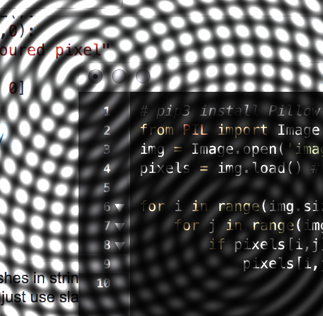

# OdooTestTask
Python 3.6

## Odd or Even
###### EXERCISE 1

Function returns ```"Odd"``` if input number is odd, and ```"Even"``` if input number is even.

## Lucky Tickets
###### EXERCISE 3

The program outputs number of lucky tickets and all possible lucky numbers.

## File Tracker
###### EXERCISE 6

The program tracks changes in given folder. In case there is new file added, program outputs its name. Based on resolution of a new file, program handles the file in a way that is provided in ```FILE_TRACKER_CONFIG.py``` .

The five actions are available:

```
'trash',
'nothing',
'add-date-to-name',
'copy-to-folder path/to/folder',
'move-to-folder path/to/folder'
```

## Wave on Image
###### EXERCISE 7

The program generates waves on an image. Two waves are available linear and radial. Waves may overlap on an image.



